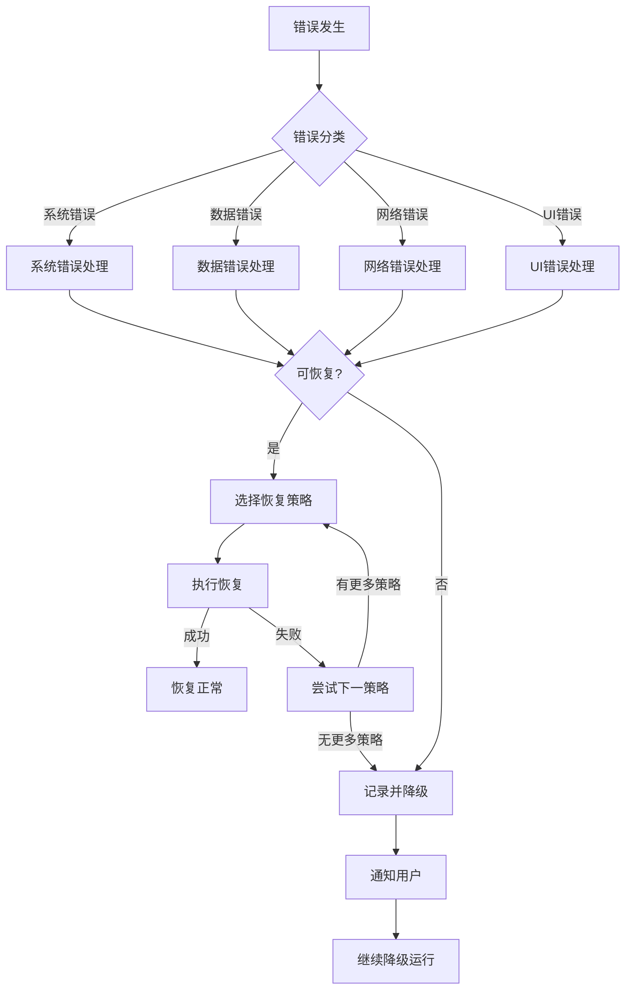

# 错误恢复机制开发计划

## 1. 功能概述

错误恢复机制是 claudecat 的重要保障功能，确保系统在遇到各种异常情况时能够优雅降级、自动恢复，并保持基本功能可用。该机制涵盖文件访问错误、JSON 解析错误、UI 渲染异常等多种场景，并提供完善的日志记录和错误报告功能。

### 1.1 核心目标

- **高可用性**: 即使部分功能失败，核心功能仍然可用
- **优雅降级**: 根据错误级别采取不同的降级策略
- **自动恢复**: 检测错误消除后自动恢复正常功能
- **错误追踪**: 完整的错误日志和诊断信息
- **用户友好**: 清晰的错误提示和恢复建议

## 2. 技术设计

### 2.1 错误分类体系

```go
// ErrorType 错误类型
type ErrorType string

const (
    // 系统级错误
    ErrorTypeSystem      ErrorType = "system"
    ErrorTypePermission  ErrorType = "permission"
    ErrorTypeResource    ErrorType = "resource"
    
    // 数据错误
    ErrorTypeDataFormat  ErrorType = "data_format"
    ErrorTypeDataCorrupt ErrorType = "data_corrupt"
    ErrorTypeDataMissing ErrorType = "data_missing"
    
    // 网络错误
    ErrorTypeNetwork     ErrorType = "network"
    ErrorTypeTimeout     ErrorType = "timeout"
    
    // 应用错误
    ErrorTypeConfig      ErrorType = "config"
    ErrorTypeLogic       ErrorType = "logic"
    ErrorTypeUI          ErrorType = "ui"
)

// ErrorSeverity 错误严重程度
type ErrorSeverity int

const (
    SeverityLow      ErrorSeverity = iota // 可忽略
    SeverityMedium                        // 功能降级
    SeverityHigh                          // 需要干预
    SeverityCritical                      // 系统停止
)

// RecoverableError 可恢复错误
type RecoverableError struct {
    Type        ErrorType
    Severity    ErrorSeverity
    Message     string
    Cause       error
    Context     map[string]interface{}
    Timestamp   time.Time
    RecoveryHint string
    CanRetry    bool
    RetryAfter  time.Duration
}

// ErrorContext 错误上下文
type ErrorContext struct {
    Component   string
    Operation   string
    User        string
    SessionID   string
    TraceID     string
    Metadata    map[string]interface{}
}
```

### 2.2 错误恢复策略

```go
// RecoveryStrategy 恢复策略接口
type RecoveryStrategy interface {
    CanHandle(err error) bool
    Recover(err error, context *ErrorContext) error
    GetFallback() interface{}
}

// RecoveryManager 恢复管理器
type RecoveryManager struct {
    strategies      map[ErrorType][]RecoveryStrategy
    fallbackChain   []FallbackHandler
    circuitBreaker  *CircuitBreaker
    retryPolicy     *RetryPolicy
    errorCollector  *ErrorCollector
    config          RecoveryConfig
}

// RecoveryConfig 恢复配置
type RecoveryConfig struct {
    MaxRetries           int
    RetryBackoff         BackoffStrategy
    CircuitBreakerConfig CircuitBreakerConfig
    EnableAutoRecovery   bool
    RecoveryTimeout      time.Duration
    ErrorThreshold       int
}

// CircuitBreaker 熔断器
type CircuitBreaker struct {
    state           State
    failures        int
    successes       int
    lastFailureTime time.Time
    config          CircuitBreakerConfig
    mu              sync.RWMutex
}

// State 熔断器状态
type State int

const (
    StateClosed    State = iota // 正常
    StateOpen                   // 熔断
    StateHalfOpen              // 半开
)
```

## 3. 实现步骤

### 3.1 核心错误处理器

**文件**: `errors/handler.go`

```go
package errors

import (
    "context"
    "fmt"
    "runtime/debug"
    "sync"
    "time"
)

// ErrorHandler 全局错误处理器
type ErrorHandler struct {
    recoveryManager *RecoveryManager
    errorLogger     *ErrorLogger
    alertManager    *AlertManager
    metrics         *ErrorMetrics
    
    // 错误缓冲
    errorBuffer     *RingBuffer
    bufferMu        sync.RWMutex
    
    // 状态跟踪
    healthStatus    HealthStatus
    degradedMode    bool
}

// NewErrorHandler 创建错误处理器
func NewErrorHandler(config Config) *ErrorHandler {
    handler := &ErrorHandler{
        recoveryManager: NewRecoveryManager(config.Recovery),
        errorLogger:     NewErrorLogger(config.Logging),
        alertManager:    NewAlertManager(config.Alerts),
        metrics:         NewErrorMetrics(),
        errorBuffer:     NewRingBuffer(1000),
        healthStatus:    HealthStatusHealthy,
    }
    
    // 注册恢复策略
    handler.registerDefaultStrategies()
    
    // 启动监控
    go handler.monitorHealth()
    
    return handler
}

// Handle 处理错误
func (eh *ErrorHandler) Handle(err error, context *ErrorContext) error {
    // 分类错误
    classified := eh.classifyError(err)
    
    // 记录错误
    eh.logError(classified, context)
    
    // 更新指标
    eh.updateMetrics(classified)
    
    // 尝试恢复
    if classified.CanRetry {
        if recovered := eh.tryRecover(classified, context); recovered == nil {
            return nil
        }
    }
    
    // 检查是否需要降级
    if eh.shouldDegrade(classified) {
        eh.enterDegradedMode()
    }
    
    // 发送告警
    if classified.Severity >= SeverityHigh {
        eh.alertManager.SendAlert(classified, context)
    }
    
    return classified
}

// HandlePanic 处理 panic
func (eh *ErrorHandler) HandlePanic(context *ErrorContext) {
    if r := recover(); r != nil {
        // 获取堆栈信息
        stack := debug.Stack()
        
        // 创建 panic 错误
        panicErr := &PanicError{
            Value:     r,
            Stack:     string(stack),
            Timestamp: time.Now(),
            Context:   context,
        }
        
        // 记录严重错误
        eh.Handle(panicErr, context)
        
        // 尝试恢复
        if eh.recoveryManager.CanRecoverFromPanic(panicErr) {
            eh.recoveryManager.RecoverFromPanic(panicErr)
        } else {
            // 无法恢复，优雅关闭
            eh.gracefulShutdown(panicErr)
        }
    }
}

// classifyError 分类错误
func (eh *ErrorHandler) classifyError(err error) *RecoverableError {
    // 检查是否已经是分类错误
    if re, ok := err.(*RecoverableError); ok {
        return re
    }
    
    // 根据错误类型分类
    classified := &RecoverableError{
        Cause:     err,
        Timestamp: time.Now(),
    }
    
    switch {
    case isPermissionError(err):
        classified.Type = ErrorTypePermission
        classified.Severity = SeverityHigh
        classified.RecoveryHint = "Check file permissions and user privileges"
        classified.CanRetry = false
        
    case isJSONError(err):
        classified.Type = ErrorTypeDataFormat
        classified.Severity = SeverityMedium
        classified.RecoveryHint = "Skip corrupted entry and continue"
        classified.CanRetry = false
        
    case isNetworkError(err):
        classified.Type = ErrorTypeNetwork
        classified.Severity = SeverityMedium
        classified.RecoveryHint = "Retry with exponential backoff"
        classified.CanRetry = true
        classified.RetryAfter = 5 * time.Second
        
    case isResourceError(err):
        classified.Type = ErrorTypeResource
        classified.Severity = SeverityHigh
        classified.RecoveryHint = "Free up system resources"
        classified.CanRetry = true
        classified.RetryAfter = 30 * time.Second
        
    default:
        classified.Type = ErrorTypeSystem
        classified.Severity = SeverityMedium
        classified.CanRetry = true
    }
    
    classified.Message = eh.generateErrorMessage(classified)
    
    return classified
}

// tryRecover 尝试恢复
func (eh *ErrorHandler) tryRecover(err *RecoverableError, context *ErrorContext) error {
    // 获取恢复策略
    strategies := eh.recoveryManager.GetStrategies(err.Type)
    
    for _, strategy := range strategies {
        if strategy.CanHandle(err) {
            // 使用熔断器保护
            result := eh.recoveryManager.circuitBreaker.Execute(func() error {
                return strategy.Recover(err, context)
            })
            
            if result == nil {
                // 恢复成功
                eh.metrics.RecoverySuccess.Inc()
                return nil
            }
        }
    }
    
    // 所有策略都失败
    eh.metrics.RecoveryFailed.Inc()
    return err
}

// registerDefaultStrategies 注册默认恢复策略
func (eh *ErrorHandler) registerDefaultStrategies() {
    // 文件访问错误恢复
    eh.recoveryManager.RegisterStrategy(ErrorTypePermission, &FileAccessRecovery{})
    
    // JSON 解析错误恢复
    eh.recoveryManager.RegisterStrategy(ErrorTypeDataFormat, &JSONParseRecovery{})
    
    // 网络错误恢复
    eh.recoveryManager.RegisterStrategy(ErrorTypeNetwork, &NetworkErrorRecovery{
        retryPolicy: NewExponentialBackoff(3, 1*time.Second),
    })
    
    // 资源错误恢复
    eh.recoveryManager.RegisterStrategy(ErrorTypeResource, &ResourceErrorRecovery{})
}
```

### 3.2 具体恢复策略实现

**文件**: `errors/strategies.go`

```go
package errors

import (
    "encoding/json"
    "fmt"
    "os"
    "time"
)

// FileAccessRecovery 文件访问错误恢复
type FileAccessRecovery struct {
    alternativePaths []string
    cache            *FileCache
}

func (f *FileAccessRecovery) CanHandle(err error) bool {
    _, ok := err.(*RecoverableError)
    return ok && isFileError(err)
}

func (f *FileAccessRecovery) Recover(err error, context *ErrorContext) error {
    recErr := err.(*RecoverableError)
    
    // 策略1: 尝试备用路径
    if altPath := f.tryAlternativePath(context); altPath != "" {
        context.Metadata["recovered_path"] = altPath
        return nil
    }
    
    // 策略2: 使用缓存数据
    if cached := f.tryCache(context); cached != nil {
        context.Metadata["using_cache"] = true
        return nil
    }
    
    // 策略3: 创建默认文件
    if f.canCreateDefault(recErr) {
        if err := f.createDefaultFile(context); err == nil {
            return nil
        }
    }
    
    return fmt.Errorf("all recovery strategies failed")
}

func (f *FileAccessRecovery) GetFallback() interface{} {
    // 返回空数据集
    return []models.UsageEntry{}
}

// JSONParseRecovery JSON 解析错误恢复
type JSONParseRecovery struct {
    validator    *JSONValidator
    repair       *JSONRepair
    skipCorrupted bool
}

func (j *JSONParseRecovery) CanHandle(err error) bool {
    _, ok := err.(*json.SyntaxError)
    if ok {
        return true
    }
    _, ok = err.(*json.UnmarshalTypeError)
    return ok
}

func (j *JSONParseRecovery) Recover(err error, context *ErrorContext) error {
    data, ok := context.Metadata["raw_data"].([]byte)
    if !ok {
        return fmt.Errorf("no raw data available")
    }
    
    // 策略1: 尝试修复 JSON
    if repaired := j.repair.TryRepair(data); repaired != nil {
        context.Metadata["repaired"] = true
        context.Metadata["data"] = repaired
        return nil
    }
    
    // 策略2: 跳过损坏的行
    if j.skipCorrupted {
        context.Metadata["skip"] = true
        return nil
    }
    
    // 策略3: 提取部分有效数据
    if partial := j.extractPartialData(data); partial != nil {
        context.Metadata["partial"] = true
        context.Metadata["data"] = partial
        return nil
    }
    
    return fmt.Errorf("cannot recover JSON data")
}

// JSONRepair JSON 修复器
type JSONRepair struct {
    strategies []RepairStrategy
}

func (jr *JSONRepair) TryRepair(data []byte) []byte {
    for _, strategy := range jr.strategies {
        if repaired := strategy.Repair(data); repaired != nil {
            // 验证修复后的数据
            var test interface{}
            if err := json.Unmarshal(repaired, &test); err == nil {
                return repaired
            }
        }
    }
    return nil
}

// 修复策略示例
type QuoteRepairStrategy struct{}

func (q *QuoteRepairStrategy) Repair(data []byte) []byte {
    // 修复未闭合的引号
    s := string(data)
    quoteCount := 0
    inString := false
    
    for i, char := range s {
        if char == '"' && (i == 0 || s[i-1] != '\\') {
            quoteCount++
            inString = !inString
        }
    }
    
    if quoteCount%2 != 0 {
        // 添加缺失的引号
        if inString {
            s += "\""
        }
    }
    
    return []byte(s)
}

// NetworkErrorRecovery 网络错误恢复
type NetworkErrorRecovery struct {
    retryPolicy     RetryPolicy
    fallbackServers []string
    cache           *ResponseCache
}

func (n *NetworkErrorRecovery) CanHandle(err error) bool {
    return isNetworkError(err) || isTimeoutError(err)
}

func (n *NetworkErrorRecovery) Recover(err error, context *ErrorContext) error {
    endpoint := context.Metadata["endpoint"].(string)
    
    // 策略1: 重试
    retryCtx := n.retryPolicy.CreateContext()
    for retryCtx.ShouldRetry() {
        if err := n.attemptRequest(endpoint); err == nil {
            return nil
        }
        retryCtx.Wait()
    }
    
    // 策略2: 使用备用服务器
    for _, server := range n.fallbackServers {
        if err := n.attemptRequest(server); err == nil {
            context.Metadata["fallback_server"] = server
            return nil
        }
    }
    
    // 策略3: 使用缓存响应
    if cached := n.cache.Get(endpoint); cached != nil {
        context.Metadata["using_cache"] = true
        context.Metadata["response"] = cached
        return nil
    }
    
    return fmt.Errorf("network recovery failed")
}
```

### 3.3 UI 降级渲染

**文件**: `ui/fallback_renderer.go`

```go
package ui

import (
    "fmt"
    "strings"
    "github.com/charmbracelet/lipgloss"
)

// FallbackRenderer UI 降级渲染器
type FallbackRenderer struct {
    level        DegradationLevel
    errorContext *errors.ErrorContext
    styles       BasicStyles
}

// DegradationLevel 降级级别
type DegradationLevel int

const (
    LevelNormal    DegradationLevel = iota // 正常
    LevelReduced                           // 功能减少
    LevelMinimal                          // 最小功能
    LevelTextOnly                        // 纯文本
)

// NewFallbackRenderer 创建降级渲染器
func NewFallbackRenderer() *FallbackRenderer {
    return &FallbackRenderer{
        level:  LevelNormal,
        styles: NewBasicStyles(),
    }
}

// RenderDashboard 渲染降级的 Dashboard
func (fr *FallbackRenderer) RenderDashboard(data DashboardData) string {
    switch fr.level {
    case LevelNormal:
        return fr.renderFullDashboard(data)
    case LevelReduced:
        return fr.renderReducedDashboard(data)
    case LevelMinimal:
        return fr.renderMinimalDashboard(data)
    case LevelTextOnly:
        return fr.renderTextDashboard(data)
    default:
        return "Dashboard unavailable"
    }
}

// renderTextDashboard 纯文本渲染
func (fr *FallbackRenderer) renderTextDashboard(data DashboardData) string {
    var sb strings.Builder
    
    sb.WriteString("=== claudecat Dashboard (Text Mode) ===\n\n")
    
    // 基本统计
    sb.WriteString(fmt.Sprintf("Current Session: %s\n", data.SessionID))
    sb.WriteString(fmt.Sprintf("Tokens Used: %d\n", data.TotalTokens))
    sb.WriteString(fmt.Sprintf("Cost: $%.2f\n", data.TotalCost))
    sb.WriteString(fmt.Sprintf("Time Elapsed: %s\n", data.TimeElapsed))
    
    // 使用率
    if data.Plan != "" {
        sb.WriteString(fmt.Sprintf("\nPlan: %s\n", data.Plan))
        sb.WriteString(fmt.Sprintf("Usage: %.1f%%\n", data.UsagePercentage))
        
        // 简单进度条
        progress := int(data.UsagePercentage / 5) // 20个字符
        bar := strings.Repeat("#", progress) + strings.Repeat("-", 20-progress)
        sb.WriteString(fmt.Sprintf("[%s]\n", bar))
    }
    
    // 警告信息
    if data.Warning != "" {
        sb.WriteString(fmt.Sprintf("\n!!! WARNING: %s !!!\n", data.Warning))
    }
    
    // 错误信息
    if fr.errorContext != nil {
        sb.WriteString(fmt.Sprintf("\nError: %s\n", fr.errorContext.Operation))
        sb.WriteString("Running in degraded mode\n")
    }
    
    return sb.String()
}

// renderMinimalDashboard 最小功能渲染
func (fr *FallbackRenderer) renderMinimalDashboard(data DashboardData) string {
    // 使用基本的 lipgloss 样式
    title := fr.styles.Title("claudecat Monitor")
    
    stats := fmt.Sprintf(
        "Tokens: %s | Cost: $%.2f | Time: %s",
        formatNumberSimple(data.TotalTokens),
        data.TotalCost,
        data.TimeElapsed,
    )
    
    usage := ""
    if data.UsagePercentage > 0 {
        color := "#00ff00"
        if data.UsagePercentage > 90 {
            color = "#ff0000"
        } else if data.UsagePercentage > 75 {
            color = "#ffff00"
        }
        
        usage = lipgloss.NewStyle().
            Foreground(lipgloss.Color(color)).
            Render(fmt.Sprintf("Usage: %.1f%%", data.UsagePercentage))
    }
    
    return strings.Join([]string{title, stats, usage}, "\n")
}

// SafeRender 安全渲染（带错误恢复）
func SafeRender(renderer Renderer, data interface{}) string {
    defer func() {
        if r := recover(); r != nil {
            // 渲染 panic，降级到文本模式
            fallback := NewFallbackRenderer()
            fallback.level = LevelTextOnly
            fallback.errorContext = &errors.ErrorContext{
                Component: "UI",
                Operation: "Render",
                Metadata: map[string]interface{}{
                    "panic": r,
                },
            }
            
            // 尝试提取基本数据
            if dashData, ok := extractBasicData(data); ok {
                return fallback.RenderDashboard(dashData)
            }
            
            return "UI Error: Failed to render dashboard"
        }
    }()
    
    return renderer.Render(data)
}

// ComponentFallbacks 组件降级映射
var ComponentFallbacks = map[string]func(error) string{
    "ProgressBar": func(err error) string {
        return "[Progress unavailable]"
    },
    "Chart": func(err error) string {
        return "Chart: Data visualization unavailable"
    },
    "Table": func(err error) string {
        return "Table: Use 'claudecat export' for data"
    },
}
```

### 3.4 错误日志和报告

**文件**: `errors/logger.go`

```go
package errors

import (
    "encoding/json"
    "fmt"
    "os"
    "path/filepath"
    "sync"
    "time"
)

// ErrorLogger 错误日志记录器
type ErrorLogger struct {
    config      LogConfig
    writers     []LogWriter
    buffer      *LogBuffer
    encoder     LogEncoder
    mu          sync.Mutex
}

// LogConfig 日志配置
type LogConfig struct {
    Level           LogLevel
    OutputPath      string
    MaxSize         int64
    MaxAge          time.Duration
    EnableRotation  bool
    Format          LogFormat
    IncludeStack    bool
    SensitiveFields []string
}

// ErrorLogEntry 错误日志条目
type ErrorLogEntry struct {
    Timestamp   time.Time              `json:"timestamp"`
    Level       string                 `json:"level"`
    Type        ErrorType              `json:"type"`
    Message     string                 `json:"message"`
    Component   string                 `json:"component"`
    Operation   string                 `json:"operation"`
    TraceID     string                 `json:"trace_id"`
    UserID      string                 `json:"user_id,omitempty"`
    SessionID   string                 `json:"session_id,omitempty"`
    Error       string                 `json:"error"`
    Stack       string                 `json:"stack,omitempty"`
    Context     map[string]interface{} `json:"context,omitempty"`
    Recovery    *RecoveryInfo          `json:"recovery,omitempty"`
}

// RecoveryInfo 恢复信息
type RecoveryInfo struct {
    Attempted   bool          `json:"attempted"`
    Successful  bool          `json:"successful"`
    Strategy    string        `json:"strategy"`
    Duration    time.Duration `json:"duration"`
    RetryCount  int           `json:"retry_count"`
}

// NewErrorLogger 创建错误日志记录器
func NewErrorLogger(config LogConfig) *ErrorLogger {
    logger := &ErrorLogger{
        config:  config,
        buffer:  NewLogBuffer(1000),
        encoder: NewJSONEncoder(),
    }
    
    // 初始化写入器
    logger.initWriters()
    
    // 启动日志处理
    go logger.processLogs()
    
    return logger
}

// LogError 记录错误
func (el *ErrorLogger) LogError(err *RecoverableError, context *ErrorContext) {
    entry := &ErrorLogEntry{
        Timestamp: time.Now(),
        Level:     el.severityToLevel(err.Severity),
        Type:      err.Type,
        Message:   err.Message,
        Component: context.Component,
        Operation: context.Operation,
        TraceID:   context.TraceID,
        UserID:    context.User,
        SessionID: context.SessionID,
        Error:     err.Cause.Error(),
        Context:   el.sanitizeContext(context.Metadata),
    }
    
    // 添加堆栈信息
    if el.config.IncludeStack && err.Severity >= SeverityHigh {
        entry.Stack = getStackTrace()
    }
    
    // 添加恢复信息
    if recovery := context.Metadata["recovery"]; recovery != nil {
        if info, ok := recovery.(*RecoveryInfo); ok {
            entry.Recovery = info
        }
    }
    
    // 写入缓冲区
    el.buffer.Write(entry)
}

// processLogs 处理日志
func (el *ErrorLogger) processLogs() {
    ticker := time.NewTicker(1 * time.Second)
    defer ticker.Stop()
    
    for range ticker.C {
        entries := el.buffer.Flush()
        if len(entries) == 0 {
            continue
        }
        
        // 批量写入
        el.mu.Lock()
        for _, writer := range el.writers {
            if err := writer.WriteBatch(entries); err != nil {
                // 写入失败，尝试备用方案
                el.handleWriteError(err, entries)
            }
        }
        el.mu.Unlock()
    }
}

// ErrorReport 错误报告生成器
type ErrorReport struct {
    Period      TimePeriod             `json:"period"`
    Summary     ErrorSummary           `json:"summary"`
    TopErrors   []ErrorGroup           `json:"top_errors"`
    Trends      ErrorTrends            `json:"trends"`
    Recovery    RecoveryStats          `json:"recovery"`
    Components  map[string]CompStats   `json:"components"`
}

// GenerateReport 生成错误报告
func GenerateErrorReport(logs []ErrorLogEntry, period TimePeriod) *ErrorReport {
    report := &ErrorReport{
        Period:     period,
        Components: make(map[string]CompStats),
    }
    
    // 计算汇总统计
    report.Summary = calculateSummary(logs)
    
    // 分组错误
    report.TopErrors = groupErrors(logs)
    
    // 分析趋势
    report.Trends = analyzeTrends(logs)
    
    // 恢复统计
    report.Recovery = calculateRecoveryStats(logs)
    
    // 组件统计
    for _, log := range logs {
        stats := report.Components[log.Component]
        stats.TotalErrors++
        stats.ErrorsByType[string(log.Type)]++
        report.Components[log.Component] = stats
    }
    
    return report
}

// ErrorDiagnostics 错误诊断工具
type ErrorDiagnostics struct {
    analyzer    *ErrorAnalyzer
    correlator  *ErrorCorrelator
    predictor   *ErrorPredictor
}

// DiagnoseError 诊断错误
func (ed *ErrorDiagnostics) DiagnoseError(err *RecoverableError, history []ErrorLogEntry) *Diagnosis {
    diagnosis := &Diagnosis{
        Error:       err,
        Timestamp:   time.Now(),
        Confidence:  0.0,
    }
    
    // 分析错误模式
    pattern := ed.analyzer.AnalyzePattern(err, history)
    diagnosis.Pattern = pattern
    
    // 查找相关错误
    correlated := ed.correlator.FindCorrelated(err, history)
    diagnosis.CorrelatedErrors = correlated
    
    // 预测影响
    impact := ed.predictor.PredictImpact(err, pattern)
    diagnosis.PredictedImpact = impact
    
    // 生成建议
    diagnosis.Recommendations = ed.generateRecommendations(diagnosis)
    
    // 计算置信度
    diagnosis.Confidence = ed.calculateConfidence(diagnosis)
    
    return diagnosis
}
```

### 3.5 监控和告警

**文件**: `errors/monitoring.go`

```go
package errors

import (
    "sync"
    "time"
)

// ErrorMonitor 错误监控器
type ErrorMonitor struct {
    metrics     *ErrorMetrics
    alerts      *AlertManager
    thresholds  ThresholdConfig
    window      *SlidingWindow
    mu          sync.RWMutex
}

// ErrorMetrics 错误指标
type ErrorMetrics struct {
    // 计数器
    TotalErrors      Counter
    ErrorsByType     map[ErrorType]Counter
    ErrorsBySeverity map[ErrorSeverity]Counter
    RecoverySuccess  Counter
    RecoveryFailed   Counter
    
    // 速率
    ErrorRate        Rate
    RecoveryRate     Rate
    
    // 延迟
    RecoveryLatency  Histogram
    
    // 状态
    CircuitBreakerState Gauge
    DegradedMode        Gauge
}

// ThresholdConfig 阈值配置
type ThresholdConfig struct {
    ErrorRateThreshold    float64
    CriticalErrorLimit    int
    RecoveryFailureLimit  int
    WindowDuration        time.Duration
}

// NewErrorMonitor 创建错误监控器
func NewErrorMonitor(config MonitorConfig) *ErrorMonitor {
    monitor := &ErrorMonitor{
        metrics:    NewErrorMetrics(),
        alerts:     NewAlertManager(config.Alerts),
        thresholds: config.Thresholds,
        window:     NewSlidingWindow(config.Thresholds.WindowDuration),
    }
    
    // 启动监控
    go monitor.runMonitoring()
    
    return monitor
}

// RecordError 记录错误
func (em *ErrorMonitor) RecordError(err *RecoverableError) {
    em.mu.Lock()
    defer em.mu.Unlock()
    
    // 更新计数器
    em.metrics.TotalErrors.Inc()
    em.metrics.ErrorsByType[err.Type].Inc()
    em.metrics.ErrorsBySeverity[err.Severity].Inc()
    
    // 更新滑动窗口
    em.window.Add(ErrorEvent{
        Type:      err.Type,
        Severity:  err.Severity,
        Timestamp: time.Now(),
    })
    
    // 计算错误率
    em.updateErrorRate()
    
    // 检查阈值
    em.checkThresholds()
}

// checkThresholds 检查阈值
func (em *ErrorMonitor) checkThresholds() {
    // 检查错误率
    if em.metrics.ErrorRate.Rate() > em.thresholds.ErrorRateThreshold {
        em.alerts.TriggerAlert(Alert{
            Type:     AlertTypeErrorRate,
            Severity: AlertSeverityWarning,
            Message:  fmt.Sprintf("Error rate exceeded threshold: %.2f errors/sec", em.metrics.ErrorRate.Rate()),
        })
    }
    
    // 检查严重错误
    criticalCount := em.window.Count(func(e ErrorEvent) bool {
        return e.Severity == SeverityCritical
    })
    
    if criticalCount > em.thresholds.CriticalErrorLimit {
        em.alerts.TriggerAlert(Alert{
            Type:     AlertTypeCriticalErrors,
            Severity: AlertSeverityCritical,
            Message:  fmt.Sprintf("Critical errors exceeded limit: %d in %v", criticalCount, em.thresholds.WindowDuration),
        })
    }
    
    // 检查恢复失败
    recoveryFailures := em.metrics.RecoveryFailed.Value()
    if recoveryFailures > int64(em.thresholds.RecoveryFailureLimit) {
        em.alerts.TriggerAlert(Alert{
            Type:     AlertTypeRecoveryFailure,
            Severity: AlertSeverityHigh,
            Message:  fmt.Sprintf("Recovery failures exceeded limit: %d", recoveryFailures),
        })
    }
}

// HealthChecker 健康检查器
type HealthChecker struct {
    checks    map[string]HealthCheck
    results   map[string]HealthResult
    mu        sync.RWMutex
}

// HealthCheck 健康检查接口
type HealthCheck interface {
    Name() string
    Check() HealthResult
}

// HealthResult 健康检查结果
type HealthResult struct {
    Status    HealthStatus
    Message   string
    Details   map[string]interface{}
    Timestamp time.Time
}

// PerformHealthCheck 执行健康检查
func (hc *HealthChecker) PerformHealthCheck() OverallHealth {
    hc.mu.Lock()
    defer hc.mu.Unlock()
    
    overall := OverallHealth{
        Status:    HealthStatusHealthy,
        Timestamp: time.Now(),
        Checks:    make(map[string]HealthResult),
    }
    
    // 执行所有检查
    for name, check := range hc.checks {
        result := check.Check()
        hc.results[name] = result
        overall.Checks[name] = result
        
        // 更新总体状态
        if result.Status > overall.Status {
            overall.Status = result.Status
        }
    }
    
    return overall
}
```

## 4. 测试计划

### 4.1 单元测试

```go
// errors/handler_test.go

func TestErrorHandler_Classification(t *testing.T) {
    handler := NewErrorHandler(testConfig)
    
    tests := []struct {
        name         string
        err          error
        expectedType ErrorType
        expectedSev  ErrorSeverity
    }{
        {
            name:         "permission error",
            err:          os.ErrPermission,
            expectedType: ErrorTypePermission,
            expectedSev:  SeverityHigh,
        },
        {
            name:         "JSON syntax error",
            err:          &json.SyntaxError{},
            expectedType: ErrorTypeDataFormat,
            expectedSev:  SeverityMedium,
        },
        {
            name:         "network timeout",
            err:          &net.OpError{Op: "dial", Err: errors.New("timeout")},
            expectedType: ErrorTypeNetwork,
            expectedSev:  SeverityMedium,
        },
    }
    
    for _, tt := range tests {
        t.Run(tt.name, func(t *testing.T) {
            classified := handler.classifyError(tt.err)
            
            assert.Equal(t, tt.expectedType, classified.Type)
            assert.Equal(t, tt.expectedSev, classified.Severity)
            assert.NotEmpty(t, classified.RecoveryHint)
        })
    }
}

func TestRecoveryStrategies(t *testing.T) {
    t.Run("file access recovery", func(t *testing.T) {
        strategy := &FileAccessRecovery{
            alternativePaths: []string{"/tmp/backup", "/var/cache/claudecat"},
            cache:            NewFileCache(),
        }
        
        err := &RecoverableError{
            Type:  ErrorTypePermission,
            Cause: os.ErrPermission,
        }
        
        context := &ErrorContext{
            Component: "FileReader",
            Operation: "OpenFile",
            Metadata: map[string]interface{}{
                "path": "/protected/file.jsonl",
            },
        }
        
        // 模拟缓存中有数据
        strategy.cache.Set("/protected/file.jsonl", testData)
        
        recoveryErr := strategy.Recover(err, context)
        assert.NoError(t, recoveryErr)
        assert.True(t, context.Metadata["using_cache"].(bool))
    })
    
    t.Run("JSON repair", func(t *testing.T) {
        repair := &JSONRepair{
            strategies: []RepairStrategy{
                &QuoteRepairStrategy{},
                &BracketRepairStrategy{},
                &TrailingCommaStrategy{},
            },
        }
        
        // 测试修复未闭合的引号
        broken := []byte(`{"key": "value`)
        repaired := repair.TryRepair(broken)
        
        assert.NotNil(t, repaired)
        
        var test map[string]string
        err := json.Unmarshal(repaired, &test)
        assert.NoError(t, err)
        assert.Equal(t, "value", test["key"])
    })
}
```

### 4.2 故障注入测试

```go
// errors/fault_injection_test.go

func TestFaultInjection(t *testing.T) {
    // 创建故障注入器
    injector := NewFaultInjector()
    
    // 配置故障场景
    injector.AddFault(FaultConfig{
        Type:        FaultTypeError,
        Probability: 0.1, // 10% 概率
        Error:       os.ErrPermission,
        Component:   "FileReader",
    })
    
    injector.AddFault(FaultConfig{
        Type:        FaultTypeLatency,
        Probability: 0.2,
        Latency:     100 * time.Millisecond,
        Component:   "NetworkClient",
    })
    
    // 运行测试
    handler := NewErrorHandler(testConfig)
    handler.EnableFaultInjection(injector)
    
    // 执行多次操作，验证错误处理
    errorCount := 0
    for i := 0; i < 100; i++ {
        err := performOperation()
        if err != nil {
            handled := handler.Handle(err, &ErrorContext{
                Component: "Test",
                Operation: "FaultInjection",
            })
            
            if handled == nil {
                // 成功恢复
            } else {
                errorCount++
            }
        }
    }
    
    // 验证错误率符合预期
    errorRate := float64(errorCount) / 100
    assert.InDelta(t, 0.1, errorRate, 0.05)
}
```

### 4.3 降级测试

```go
// ui/fallback_test.go

func TestUIFallback(t *testing.T) {
    renderer := NewFallbackRenderer()
    
    testData := DashboardData{
        SessionID:       "test-session",
        TotalTokens:     100000,
        TotalCost:       15.50,
        TimeElapsed:     "2h 30m",
        Plan:            "Pro",
        UsagePercentage: 86.1,
    }
    
    // 测试各级降级
    levels := []DegradationLevel{
        LevelNormal,
        LevelReduced,
        LevelMinimal,
        LevelTextOnly,
    }
    
    for _, level := range levels {
        t.Run(fmt.Sprintf("level_%d", level), func(t *testing.T) {
            renderer.level = level
            output := renderer.RenderDashboard(testData)
            
            // 验证输出不为空
            assert.NotEmpty(t, output)
            
            // 验证关键信息存在
            assert.Contains(t, output, "100")      // tokens
            assert.Contains(t, output, "15.5")     // cost
            assert.Contains(t, output, "86.1")     // usage
            
            // 纯文本模式额外检查
            if level == LevelTextOnly {
                assert.NotContains(t, output, "\x1b[") // 无 ANSI 转义
            }
        })
    }
}
```

## 5. 错误恢复流程图



## 6. 配置选项

### 6.1 错误恢复配置

```yaml
# config.yaml
error_recovery:
  # 全局设置
  enable_recovery: true
  max_recovery_attempts: 3
  recovery_timeout: 30s
  
  # 分类配置
  categories:
    file_errors:
      strategies:
        - alternative_paths
        - use_cache
        - create_default
      cache_ttl: 1h
      
    json_errors:
      strategies:
        - repair_json
        - skip_corrupted
        - extract_partial
      skip_corrupted_default: true
      
    network_errors:
      strategies:
        - retry_with_backoff
        - use_fallback_server
        - use_cached_response
      retry_config:
        max_retries: 3
        initial_delay: 1s
        max_delay: 30s
        multiplier: 2
        
  # 降级配置
  degradation:
    auto_degrade: true
    degrade_thresholds:
      error_rate: 0.1  # 10% 错误率
      critical_errors: 5
    recovery_check_interval: 1m
    
  # 监控告警
  monitoring:
    enable_alerts: true
    alert_channels:
      - desktop
      - log
      - webhook
    webhook_url: "https://hooks.example.com/claudecat"
    
  # 日志配置
  logging:
    level: "info"
    output_path: "~/.claudecat/errors.log"
    max_size: 100MB
    max_age: 30d
    include_stack: true
    format: "json"
```

## 7. 错误处理最佳实践

### 7.1 错误包装

```go
// 包装错误时保留上下文
func wrapError(err error, context string) error {
    return &ContextualError{
        Cause:    err,
        Context:  context,
        Location: getCallerLocation(),
        Time:     time.Now(),
    }
}

// 使用示例
if err := readFile(path); err != nil {
    return wrapError(err, fmt.Sprintf("reading config file %s", path))
}
```

### 7.2 错误传播

```go
// 错误应该向上传播，在合适的层级处理
func processData() error {
    data, err := readData()
    if err != nil {
        // 不要在这里处理，向上传播
        return fmt.Errorf("process data: %w", err)
    }
    
    // 处理数据
    return nil
}

func main() {
    if err := processData(); err != nil {
        // 在顶层统一处理
        errorHandler.Handle(err, context)
    }
}
```

## 8. 部署清单

- [ ] 实现 `errors/handler.go`
- [ ] 实现 `errors/strategies.go`
- [ ] 实现 `errors/logger.go`
- [ ] 实现 `errors/monitoring.go`
- [ ] 实现 `ui/fallback_renderer.go`
- [ ] 添加错误分类系统
- [ ] 实现恢复策略
- [ ] 添加熔断器
- [ ] 实现降级机制
- [ ] 添加监控告警
- [ ] 编写单元测试
- [ ] 故障注入测试
- [ ] 集成测试
- [ ] 更新配置
- [ ] 编写文档

## 9. 未来增强

- 智能错误预测
- 自动错误修复
- 分布式错误追踪
- 错误模式学习
- 自定义恢复策略
- 错误可视化面板
- A/B 测试恢复策略
- 与监控系统集成